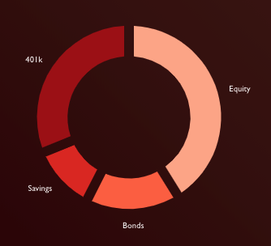

####Prerequisites
***
Due to login requirements, users must have a Google account, or they must create one upon sign in.

####Homepage
***
The user enters the GameStop Finance app on the homescreen. They login by selecting a highly formatted button that takes them to a pop up Google login screen. The button and login are streamlined and cohesive with the rest of the site. The login is handled by a Google api.
The homepage is arranged like the rest of the site, and it gives the users a good indication of what the site will look like. 

At the bottom of the screen, the prompt and button for the user to input their financial information is displayed. (see example below)

####User Information 
***
The user information page contains an overview of the user's account and gives a visual representation of what they can do with GameStop Finance. This page contains a graph with the user's provided information with links to various other options for their account. (see example below) It also provides the link for users to input their personal information and finances. The form currently asks for 401k value, bonds value, savings value, and equity value.

####Logout 
***
The logout button is in the top right of the user information page. It logs the user out of their account and returns them to the homescreen to log back in or possibly login to a different account. 

####Version
***
Currently, GameStop Finance is in development of Version 1

####Contributing
***
GameStop Finance Team Members:
*Drew Lindsay
*Nicholas Grovich
*William James
*Aden Oliver
*Foster Roush

####Acknowledgments
***
CSCI 387 